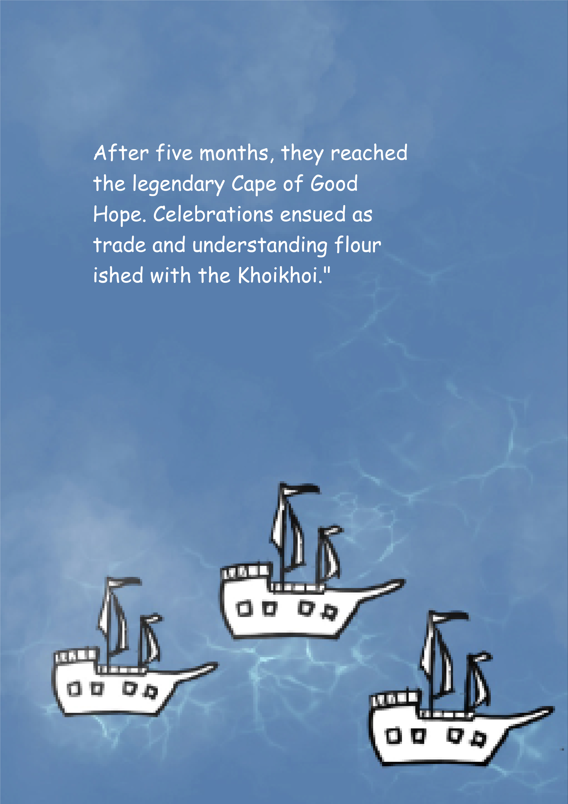
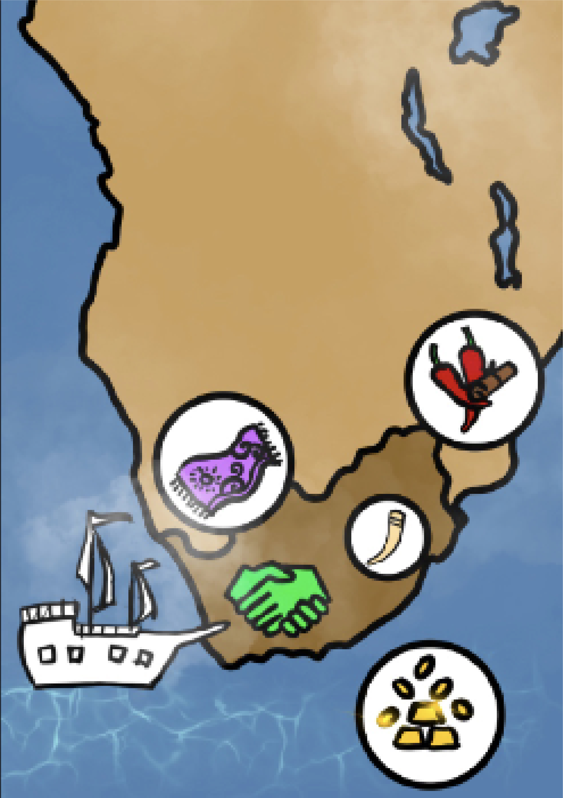
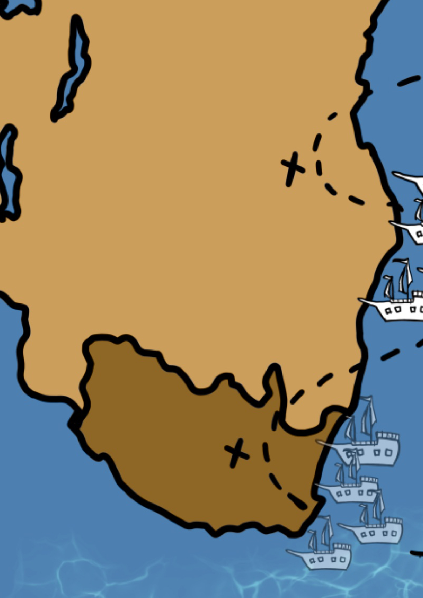

# AR Tracking Navigation
 
This is an AR mobile application made for a University Group Project.
The book is about the Vasco Da Gamas first voyage. 

The application can be built and run on an Android phone

    

        
        
This is the cover of the book

    

    <!-- First Row -->
    

        
        

    

    

        
        

    

    

        
        

    

    

        
        

    

    

        
        

    

    

        
        

    

    

        
        

    

    

        
        

    

    

        
    

    

        
    

    

        
    

Pictures of the book

